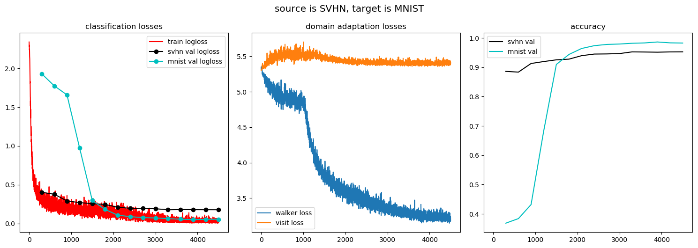
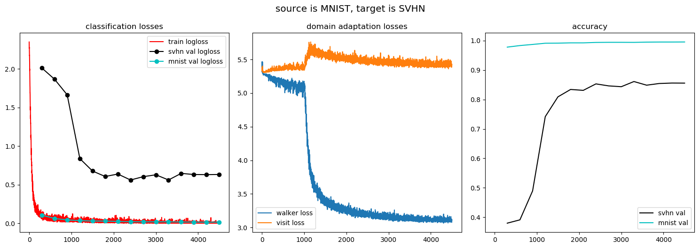

This is a `pytorch` implementation of [Associative Domain Adaptation](https://arxiv.org/abs/1708.00938).

### Domain adaptation results

| val :arrow_down:, train :arrow_right: | just svhn | just mnist | svhn to mnist | mnist to svhn |
|---|---|---|---|---|
| svhn | 93.9 | 60.3 | 95.3 | 85.6 |
| mnist | 59.3 | 99.4 | 98.3 | 99.6 |

### Notes
1. I randomly color MNIST dataset during training and evaluation (see `input_pipeline.py`).
2. To get "just svhn" and "just mnist" results run `train_usual.py`.
3. To get "svhn to mnist" and "mnist to svhn" results run `train.py`.
4. All four networks were trained for 15 epochs with the same hyperparameters.

### Training curves

### Deep CORAL

Here are results for [Deep CORAL: Correlation Alignment for Deep Domain Adaptation](https://arxiv.org/abs/1607.01719).

| val :arrow_down:, train :arrow_right: | svhn to mnist | mnist to svhn |
|---|---|---|
| svhn  | 95.2 | 61.2 |
| mnist | 78.8 | 99.5 |

To get these results run `train_deep_coral.py`.

### Requirements
1. pytorch 1.0
2. numpy, Pillow

### Other implementations
1. [stes/torch-associative](https://github.com/stes/torch-associative)
2. [haeusser/learning_by_association](https://github.com/haeusser/learning_by_association)
